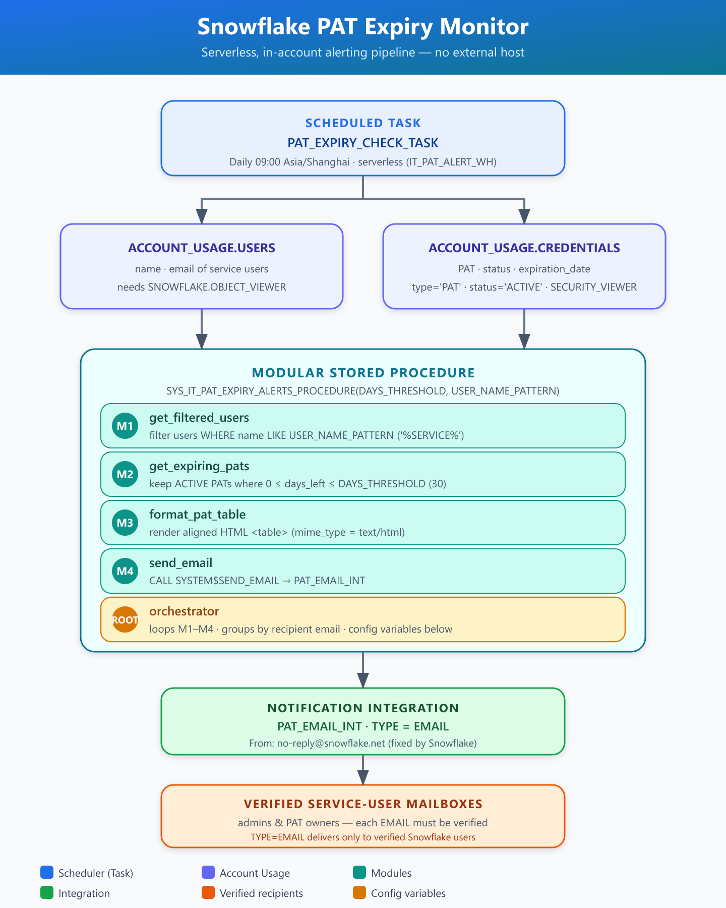

# Snowflake PAT Expiry Monitor

## Overview

Automated, **in-account** monitoring of Snowflake Programmatic Access Tokens (PATs) that
alerts token owners *before* expiry — no external host required. A daily Snowflake Task
runs a Python stored procedure that:

1. Finds service users (by a name pattern).
2. Finds their PATs expiring within a configurable window (default **30 days**).
3. Emails each owner a clean HTML table of the at-risk tokens.

## How it works (high level)

```
ACCOUNT_USAGE.CREDENTIALS (TYPE='PAT')  +  ACCOUNT_USAGE.USERS
                         │
        Snowflake Task  (CRON 09:00 Asia/Shanghai,  WH = IT_PAT_ALERT_WH)
                         │   CALL SYS_IT_PAT_EXPIRY_ALERTS_PROCEDURE(30, '%SERVICE%')
                         ▼
        Python Stored Procedure  (M1 → M2 → M3 → M4  +  ROOT)
                         │   SYSTEM$SEND_EMAIL  (TYPE=EMAIL integration, text/html)
                         ▼
        Owner mailbox  (From: no-reply@snowflake.net)
```

See `pat_expiry_architecture.png` / `pat_expiry_architecture.svg` for the full flow diagram.

## Prerequisites

- **ACCOUNTADMIN** (or role with `CREATE INTEGRATION`) to create the notification integration — run once.
- **DEVOPS_ROLE** (or your ops role) to own the grants, procedure, and task.
- Each email recipient must be a **verified Snowflake user** (Step 2).
- Warehouse `IT_PAT_ALERT_WH`, database `SYSTEM`, schema `PUBLIC`.

## Configuration

| Parameter          | Value                     | Where                                  |
|--------------------|---------------------------|----------------------------------------|
| Database.Schema    | SYSTEM.PUBLIC             | procedure + task                       |
| Warehouse          | IT_PAT_ALERT_WH           | task                                   |
| Role               | DEVOPS_ROLE               | all DDL                                |
| Notification int.  | PAT_EMAIL_INT             | TYPE=EMAIL                             |
| DAYS_THRESHOLD     | 30                        | procedure argument                     |
| USER_NAME_PATTERN  | '%SERVICE%'               | procedure argument (filters service users) |
| EMAIL_INTEGRATION  | 'PAT_EMAIL_INT'           | inside the procedure                   |
| SIGN_OFF           | TTID-DATA-SERVICE-TEAM    | closing line in the email body         |

## Setup (run in order)

### STEP 0 — Grants (shared ACCOUNT_USAGE views)

```sql
USE ROLE ACCOUNTADMIN;

GRANT DATABASE ROLE SNOWFLAKE.SECURITY_VIEWER TO ROLE DEVOPS_ROLE;  -- ACCOUNT_USAGE.CREDENTIALS
GRANT DATABASE ROLE SNOWFLAKE.OBJECT_VIEWER  TO ROLE DEVOPS_ROLE;  -- ACCOUNT_USAGE.USERS
```

> You **cannot** `GRANT SELECT` on the shared `SNOWFLAKE.ACCOUNT_USAGE` database.
> Use the database roles above instead.

### STEP 1 — Notification integration (TYPE=EMAIL)

```sql
USE ROLE ACCOUNTADMIN;

CREATE NOTIFICATION INTEGRATION PAT_EMAIL_INT
  TYPE = EMAIL
  ENABLED = TRUE
  ALLOWED_RECIPIENTS = ('shawn.y.wang@scania.com.cn', 'sharafat.hussain@scania.com.cn');
```

> Every recipient the procedure emails (PAT owners **and** any CC) must be a verified
> Snowflake user **and** be listed in `ALLOWED_RECIPIENTS`. Add owner addresses as you
> provision them.

### STEP 2 — Verify recipient emails

Each recipient must click a one-time verification link:

```sql
USE ROLE ACCOUNTADMIN;

SELECT SYSTEM$START_USER_EMAIL_VERIFICATION('RND_TTR_SF_SERVICE_USER');
SELECT SYSTEM$START_USER_EMAIL_VERIFICATION('SHARAFAT');
```

The user receives an email and must confirm. Unverified recipients fail silently per-message.

### STEP 3 — Create the stored procedure

Run the full `pat_expiry_modular.sql` (creates `SYS_IT_PAT_EXPIRY_ALERTS_PROCEDURE`).
Signature:

```sql
CREATE OR REPLACE PROCEDURE SYSTEM.PUBLIC.SYS_IT_PAT_EXPIRY_ALERTS_PROCEDURE(
  DAYS_THRESHOLD    FLOAT,
  USER_NAME_PATTERN STRING
)
RETURNS STRING
LANGUAGE PYTHON
RUNTIME_VERSION = 3.11
PACKAGES = ('snowflake-snowpark-python')
HANDLER = 'main'
AS $$
...   -- see pat_expiry_modular.sql
$$;
```

### STEP 4 — Create + resume the daily task

```sql
USE ROLE DEVOPS_ROLE;

CREATE OR REPLACE TASK SYSTEM.PUBLIC.SYS_IT_PAT_EXPIRY_ALERTS_TASK
  WAREHOUSE = IT_PAT_ALERT_WH
  SCHEDULE = 'USING CRON 0 9 * * * Asia/Shanghai'
AS
  CALL SYSTEM.PUBLIC.SYS_IT_PAT_EXPIRY_ALERTS_PROCEDURE(30, '%SERVICE%');

ALTER TASK SYSTEM.PUBLIC.SYS_IT_PAT_EXPIRY_ALERTS_TASK RESUME;
```

> Tasks are created **SUSPENDED** — the `RESUME` is mandatory, otherwise nothing runs.

## Procedure design (modules)

- **M1 `get_filtered_users`** — service users matching `USER_NAME_PATTERN` (active, not deleted).
- **M2 `get_expiring_pats`** — fetches **all** ACTIVE PATs for those users, then filters
  `0 ≤ days_left ≤ DAYS_THRESHOLD` in Python (avoids SQL date-binding pitfalls seen earlier).
- **M3 `format_pat_table`** — builds an HTML table (User · PAT · Expires UTC · Days left), HTML-escaped.
- **M4 `send_email`** — `SYSTEM$SEND_EMAIL(..., 'text/html')` via `PAT_EMAIL_INT`.
- **ROOT** — groups PATs by **recipient email**, so:
  - one user with several expiring PATs → a single email listing all of them, and
  - two users sharing an address → a single consolidated email.
  Builds the subject + body (with the `TTID-DATA-SERVICE-TEAM` sign-off) and reports any
  users with no verifiable email plus any failed sends.

## Operations

Manual test run:

```sql
CALL SYSTEM.PUBLIC.SYS_IT_PAT_EXPIRY_ALERTS_PROCEDURE(30, '%SERVICE%');
```

Task status:

```sql
SHOW TASKS LIKE 'SYS_IT_PAT_EXPIRY_ALERTS_TASK';
SELECT * FROM TABLE(INFORMATION_SCHEMA.TASK_HISTORY());
```

If no PATs are near expiry, the run logs `No PATs expiring…` and sends **nothing** — silent by design.

Pause / resume:

```sql
ALTER TASK SYSTEM.PUBLIC.SYS_IT_PAT_EXPIRY_ALERTS_TASK SUSPEND;
ALTER TASK SYSTEM.PUBLIC.SYS_IT_PAT_EXPIRY_ALERTS_TASK RESUME;
```

Cleanup / rebuild:

```sql
USE ROLE DEVOPS_ROLE;

DROP TASK IF EXISTS SYSTEM.PUBLIC.SYS_IT_PAT_EXPIRY_ALERTS_TASK;
DROP PROCEDURE IF EXISTS SYSTEM.PUBLIC.SYS_IT_PAT_EXPIRY_ALERTS_PROCEDURE(FLOAT, STRING);

-- (ACCOUNTADMIN) DROP INTEGRATION PAT_EMAIL_INT;
```

## Email format

HTML table, columns aligned in any client:

| User                   | PAT           | Expires (UTC)        | Days left |
|------------------------|---------------|----------------------|-----------|
| RND_TTR_SF_SERVICE_USER| prod_etl_pat  | 2026-09-15 03:22     | 25        |

Closing line: `Best regards, DATA-SERVICE-TEAM`

## Known limitations

- **Sender is fixed** to `no-reply@snowflake.net` (hard constraint of TYPE=EMAIL). A custom
  From (e.g. `dataservice@example.com.cn`) requires switching to `TYPE=QUEUE` plus your own
  email relay — intentionally **out of scope** for this README.
- **Recipients must be verified Snowflake users**; unverified addresses fail per-message.
- `ACCOUNT_USAGE` has ~2h latency (irrelevant for a 30-day lead time).
- `SYSTEM$SEND_EMAIL` body is capped (~2048 chars) — fine for typical token counts.

## Files

- `pat_expiry_modular.sql` — the stored procedure (+ optional task DDL).
- `pat_expiry_architecture.png` / `.svg` — flow diagram.
- `README.md` — this file.
